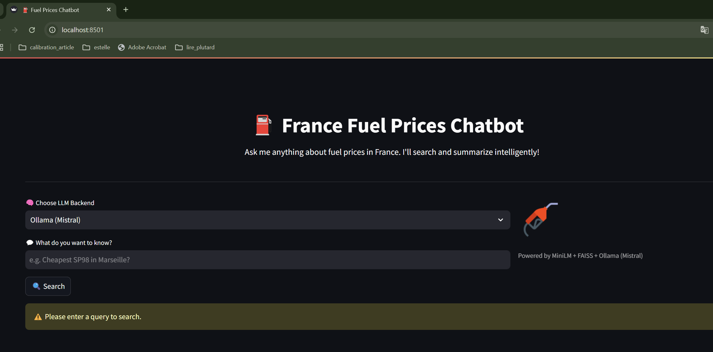

# Fuel Prices France Chatbot

A conversational AI assistant that helps users discover the latest **fuel prices** across France. The chatbot leverages real-time government data, processes it using an ETL pipeline, and allows natural language querying through a Streamlit or Chainlit-powered interface — enhanced with semantic search using FAISS and MiniLM embeddings.

## Table of Contents

- [Project Overview](#project-overview)
- [Features](#features)
- [Project Structure](#project-structure)
- [How to Run (Docker or Manual)](#how-to-run-docker-or-manual)
  - [1️⃣ Clone the Repo](#1-clone-the-repo)
  - [2️⃣ Option A: Run with Docker Compose](#2-option-a-run-with-docker-compose)
  - [3️⃣ Option B: Run Locally without Docker](#3-option-b-run-locally-without-docker)
- [ETL Pipeline](#etl-pipeline-extract-transform-load--embeddings)
- [Chatbot Interface](#chatbot-interface)
- [Example Flow](#example-flow)
- [Automate Daily ETL](#automate-daily-etl)
- [Docker Notes](#docker-notes-if-running-chatbot-inside-a-container)
- [Read the Full Medium Article](#read-the-full-medium-article)
- [Future Improvements](#future-improvements)
- [Features Summary](#features-summary)
- [Contributions & Feedback](#contributions--feedback)

---

## Project Overview
Fuel prices in France change regularly and vary widely across regions. This chatbot makes it easier to:

- Fetch **latest fuel price data** from the French government API.
- Process and embed the data using **sentence-transformers** and **FAISS**.
- Search semantically across stations using natural language.
- Respond intelligently using **LLM inference with Ollama** (Mistral/Gemma).
- Interact via **Streamlit UI** or **Chainlit chat interface**.

> Think of it as ChatGPT for fuel prices — localized to France.

---

## Features

- Real-time fuel data from [data.gouv.fr](https://www.data.gouv.fr)
- Full ETL pipeline: Extract, Transform, Load
- Embedding-based semantic search with MiniLM + FAISS
- Local LLM inference with Mistral/Gemma via Ollama
- Natural language querying via Streamlit and Chainlit interfaces
- Location-aware search: city, department, region
- Easy deployment with Docker Compose

---

## Project Structure

```bash
fuel-prices-fr-chatbot/
├── app/                    # Chatbot UIs
│   ├── chatbot.py          # Streamlit version
│   └── chatbot_chainlit.py # Chainlit version
├── data/                  # Raw, processed, and indexed data
│   ├── raw_data_YYYY-MM-DD.json
│   ├── processed_data_YYYY-MM-DD.csv
│   ├── fuel_prices.db
│   ├── embeddings.pkl
│   └── faiss_index
├── etl/                   # ETL pipeline scripts
│   ├── fetch_data.py
│   ├── transform_data.py
│   ├── load_data.py
│   ├── process_fuel_embeddings.py
│   └── run_etl.py
├── utilities/             # Utility scripts
│   └── utils.py
├── requirements.txt       # Python dependencies
├── Dockerfile
├── docker-compose.yml
├── fuel_data_processing.log
├── assets/                # Illustrations
│   ├── api_illustration.png
│   ├── ollama.png
│   ├── app.png
│   ├── chain-stream_illustration.png
│   └── response_context.png
└── README.md
```

---

## Prerequisite

The chatbot now supports **Mistral** via [Ollama](https://ollama.com), allowing you to use a more powerful local LLM for response generation.

### Required Software
- [Ollama](https://ollama.com/download)
- [Docker](https://www.docker.com/) (for Dockerized deployment)
- Python 3.10+

### What's New:
- Option to choose **Gemma** or **Mistral** via Ollama
- Ollama streaming support with chunked response handling
- Automatic check to ensure the Ollama server is running

### How to Enable Mistral via Ollama:
1. [Install Ollama](https://ollama.com/download)
2. Run the model locally:
```bash
ollama run mistral
```
3. In the chatbot, select **"Ollama (Mistral)"** from the dropdown before submitting your query.

> Ollama must be running on `http://localhost:11434` for the chatbot to work with Mistral.


---

## Setup Instructions

### 1. Clone the Repository and run ollama

#### a. Clone the Repository
```bash
git clone https://github.com/cartelgouabou/fuel-prices-fr-chatbot.git
cd fuel-prices-fr-chatbot
```
#### b. Run Ollama locally
```bash
ollama run mistral
```

### 2. Option A: Run with Docker Compose (Recommended)

#### a. Start the full stack
```bash
docker-compose up --build
```

#### b. Open the interfaces
- Streamlit UI: http://localhost:8501
- Chainlit UI: http://localhost:8000

### 3. Option B: Manual Setup (No Docker)

#### a. Create & activate virtual environment
```bash
python -m venv venv-fuel
source venv-fuel/bin/activate  # Windows: venv-fuel\Scripts\activate
```

#### b. Install dependencies
```bash
pip install -r requirements.txt
```

#### c. Run the ETL pipeline
```bash
python etl/run_etl.py
```

#### d. Launch chatbot UI
```bash
streamlit run app/chatbot.py
# or
chainlit run app/chatbot_chainlit.py --host 0.0.0.0 --port 8000
```

---

## ETL Pipeline: Extract, Transform, Load + Embeddings

Run everything with:
```bash
python etl/run_etl.py
```

### 1. `fetch_data.py`
- Calls French API
- Downloads fuel station data
- Saves JSON


### 2. `transform_data.py`
- Cleans and normalizes fields
- Outputs CSV

### 3. `load_data.py`
- Creates/updates SQLite database
- Adds only new or modified stations

### 4. `process_fuel_embeddings.py`
- Generates descriptive text per station
- Embeds with MiniLM
- Stores FAISS index + metadata

### 5. `run_etl.py`
- Orchestrates the entire ETL + embedding process

---

## Chatbot Interface

###  Streamlit UI
```bash
streamlit run app/chatbot.py
```


###  Chainlit UI
```bash
chainlit run app/chatbot_chainlit.py --host 0.0.0.0 --port 8000
```


---

## Example Flow

1. User query: _"Cheapest E10 in Lyon?"_
2. Keyword location detection: Lyon
3. Semantic FAISS search with embedding similarity
4. Prompt constructed: Context + question
5. Response generated via Mistral through Ollama
6. LLM output + context shown


---

## Automate Daily ETL

Keep your data fresh using scheduled tasks:

### Linux/macOS (via `cron`)
```bash
crontab -e
```
Add the following line:
```cron
0 3 * * * /path/to/venv-fuel/bin/python /path/to/project/etl/run_etl.py >> /path/to/logs/etl_cron.log 2>&1
```

### Windows (via Task Scheduler)
- Create a new task
- Set daily trigger (e.g. 3AM)
- Action: Start a program
```
Program/script: C:\path\to\venv-fuel\Scripts\python.exe
Add arguments: C:\path\to\fuel-prices-fr-chatbot\etl\run_etl.py
```

---

## Docker Notes (if running chatbot inside a container)

If you plan to run the chatbot (Chainlit or Streamlit) inside a Docker container, and your **Ollama server is running on the host**, you must adapt the API URL:

### 🔧 Modify API Endpoint in Code
Replace all occurrences of:
```python
"http://localhost:11434/api/generate"
```
With:
```python
"http://host.docker.internal:11434/api/generate"  # For Docker
```
This ensures the container can reach the Ollama server running on the host.

### 📍 Example Update (in `app/chatbot_chainlit.py` or `app/chatbot.py`)
```python
# requests.get("http://localhost:11434", timeout=2)
requests.get("http://host.docker.internal:11434", timeout=2)  # For Docker
```

And for generation:
```python
# "http://localhost:11434/api/generate"
"http://host.docker.internal:11434/api/generate"  # For Docker
```

Make sure to restart the container after modifying the code.

---

## 🔖 Read the Full Medium Article

Curious about how this all works step by step? Check out the complete guide:

👉 **[Créez un chatbot intelligent avec RAG – Le guide complet étape par étape](https://medium.com/@cartelgouabou/cr%C3%A9ez-un-chatbot-intelligent-avec-rag-le-guide-complet-%C3%A9tape-par-%C3%A9tape-ebd787513e47)**

It walks through the concepts, design, and implementation strategies in an accessible and practical way.

---

## Future Improvements

This project provides a solid base for chatbot-driven exploration of structured data. Here are ideas for improving or extending its capabilities:

- Improve prompt templates to guide the LLM for more accurate, structured answers
- Add fuel price graphing and geolocation-based mapping to enhance visualization
- Replace MiniLM with a more powerful or multilingual model
- Introduce GPU inference support for faster LLM generation
- Add support for map-based search using coordinates or bounding boxes
- Add unit tests and enable CI coverage to ensure pipeline reliability

---

## Features Summary

- Auto-refreshing fuel data pipeline
- Embedding-based semantic search
- Local LLM answering with Mistral or Gemma
- Intelligent geo-filtering (city, department, region)
- Interactive chatbot interface (Streamlit or Chainlit)
- Transparent and explainable responses

---

## Contributions & Feedback
Pull requests, bug reports, and feature ideas welcome!

